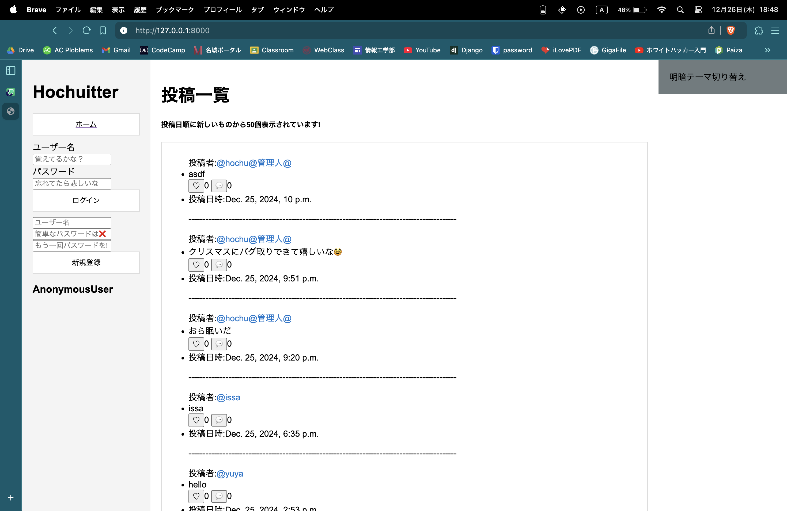
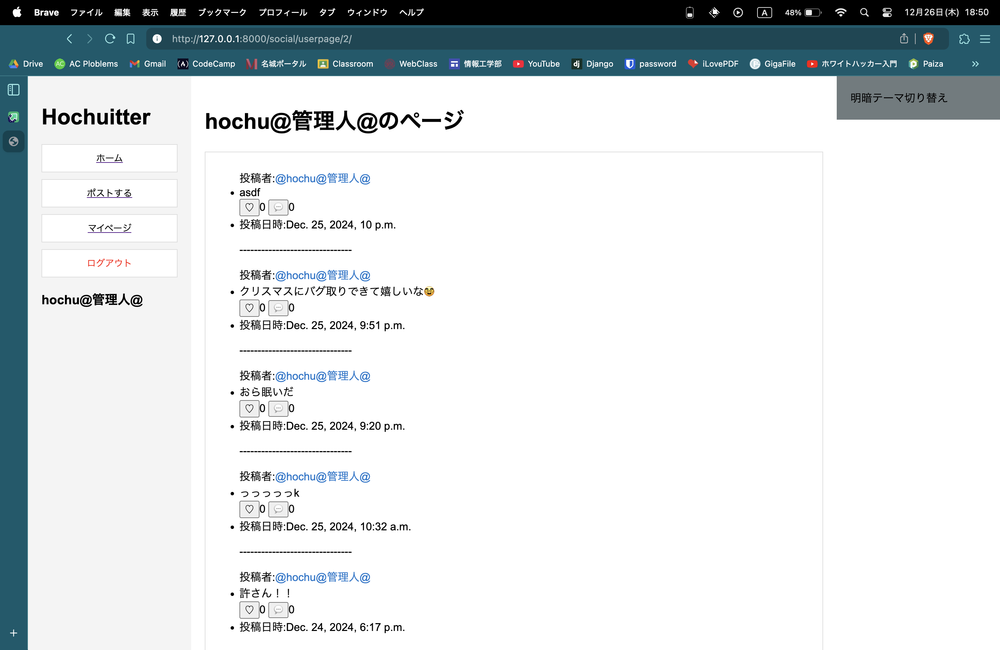
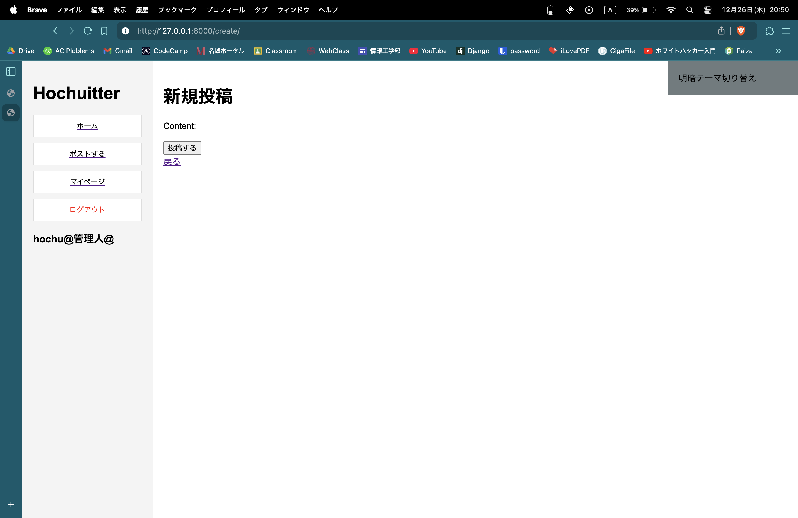

<!-- markdownlint-disable MD033 -->

# プラクティカルICT(2024年度)最終課題

---

## 所属:名城大学情報工学部情報工学科1年

## 学籍番号:241205155

## 氏名:寳中俊介

## 提出日:2024/12/26

---

### 作品概要

- **作品タイトル**: Houchitter
- **作品紹介**: ユーザが実際に投稿可能な掲示板サイト

### 作品のオリジナルな点

ユーザと共に成長していくsnsというのがこの作品のオリジナリティである．開発初期からサービスの拡大に対応できるように柔軟性を持たせたモデル構築を心がけている．例えば初期案では効率のため全ての投稿を一つのPostクラスとして定義していたが，サービスが拡大するとデータベースの検索に大きな負荷がかかることを懸念し，Postクラスとそれを親にもつCommentクラスを定義した．プロジェクトが拡大しすぎて完成が遠くなることを危惧しミニマムリリースをしたが，Followモデルや Profileモデルが残っているように，ここから追加しようと考えている機能がいくつもある．初期は最小限の構成で周りの人に少しずつ広め運用しつつフィードバックをいただき，ユーザの声をリアルタイムで反映していくsnsを開発していくつもりである．

### 完成度

認証，投稿，モデル定義，データの整合性など，最小限の範囲でサービスは完成しており，実際に使用可能な状態になっている．
ただ，先の章で述べたようにこのサービスは実際の運用を目的として開発に取り組んでおり，試験ユーザのフィードバックを取り入れながらサービスを拡大していく．一点だけ，django側の認証システムの関係で新規登録時に簡単なパスワードを入力すると認証されないためある程度複雑なパスワードを入力する必要がある．

### 使用技術

- **Django**: サーバサイド（モデル設計、データベース管理、URL等の管理、データ受け渡し、認証システム等）
- **Python**: Djangoフレームワークを用いて実際にサーバプログラムを作成
- **HTML, CSS**: ユーザが使用する部分
- **JavaScript**: 非同期の明暗テーマ切り替えボタンの実装
- **Git**: ファイル管理、ブランチを作成し様々な機能の実装に向けた実験を並行して行い、実験が完了してからマージ
- **Web API**: 投稿の内容をデータベースへ格納し、それを投稿一覧で表示
- **ユーザ認証システム**

  

### 作品の詳細な内容

最低限の機能が実装された掲示板サイト．
認証システムを通過（新規登録後にログイン）すると自身のアカウントでメッセージを投稿することができる．
全アカウントにはのユーザページが存在し，ホームページにて@から始まるユーザ名をクリックすると移動することができ，該当ユーザの投稿一覧を確認することができる．
明暗テーマ切り替えボタンも画面右側にあり，ダークモードとライトモードの切り替えも可能．
未認証ユーザは閲覧しかできないので先に新規登録，ログインを済ませて使用を開始する．

### 動作環境

- asgiref==3.8.1
- Django==5.1.4
- git==2.47.0
- Python==3.12
- sqlparse==0.5.3
- sqlite3

pip install requirements.txt (初回のみ) 
source venv/bin/activate (毎回) 
cd sns (毎回) 
django manage.py makemigrations (初回のみ) 
django manage.py migrate (初回のみ) 
python manage.py runserver (毎回) 

### 動作例

ユーザ認証前のホーム画面．この状態では投稿の閲覧，投稿者のユーザページ表示のみが可能．

ユーザ認証後のホーム画面．画面左部のサイドバー下部にログイン中のアカウント名が表示される．
この状態では投稿，マイページの閲覧が可能．ログアウトボタンを押すと再度未認証の状態に戻り，ホーム画面へリダイレクトされる．

マイページの使用画面．このページには実際にはユーザページと同じテンプレートを使用しており，自身のアカウントのユーザページとなっている．
ログイン中アカウントの全投稿を閲覧可能．

投稿フォーム画面．このページで入力フォームへ投稿内容を記述し，「投稿する」ボタンを押すと実際に投稿が反映される．
ボタンを押すとすぐにホームページへリダイレクトされ，自身の投稿が確認できるだろう．

画面右上には常に「明暗テーマ切り替え」ボタンが表示されている．このボタンを押すとjavascriptが実行され，ライトテーマ・ダークテーマの切り替えを非同期で実行することが可能．

      

### 動作例に対する妥当性の考察

未認証の状態では投稿ボタンを表示していないのでエラーを防ぐ設計となっている．
投稿フォームには二重の対策として@login_requiredを用いており，未認証のユーザが仮にアクセスした場合はログインページにリダイレクトされる設計になっている．
実際にユーザが使用することはないが，未完成である点としては/loginにアクセスした時の挙動である．sns/urls.pyにて/loginを定義しているが，実際にはここはサーバエラー(505)が起こってしまう．
ここではDjango標準のライブラリを使用し認証を実装しているのだが，最後まで修正ができなかった．今後の修正対象である．

### 参考文献

[Djangoテンプレート](https://www.djangoproject.com)

### 本課題に対する感想

本課題で感じたことは，いかに設計が重要であるかということである．私は今回Djangoを用いて開発を進めていた．バックエンドやデータベースの設計を開発前に綿密に考えていたつもりであったが，実際に開発に取り掛かるとデータの受け渡しなどが主な原因となりモデルの再構成が必要になる事態が発生し，修正が困難であった．予め困難に対応できるよう柔軟なモデルの構築をしておくことが，後のサービス拡大にも大幅な修正にも対応しやすいのではないか，と考えた．

### 本授業全体に対する感想

プラクティカルICTは，API,Unity,Gitなど，実際に開発現場で使用されている技術について，まさに実践的に学ことができる良い授業であったと感じている．
一つ感じていることは，この授業ではあえて学生への解説を少なくしているのではないかということである．
エンジニアとして全てを１から他者に教えてもらっていては何も成長しないということは情報工学部での学びの1年間での気づきである．
授業毎の課題についてはどれも自身で探求していく必要があったので少し難しいと感じることもあったが，自身で理解をしてから行動して行ったためとても勉強になった．
